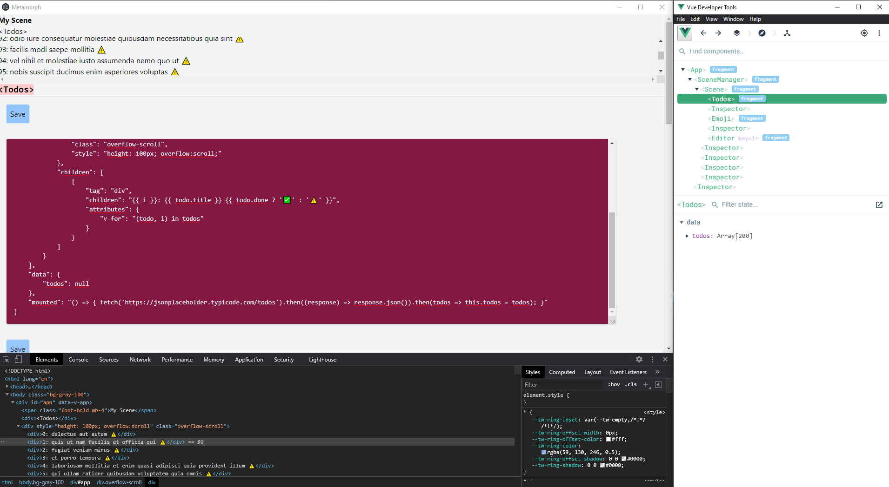
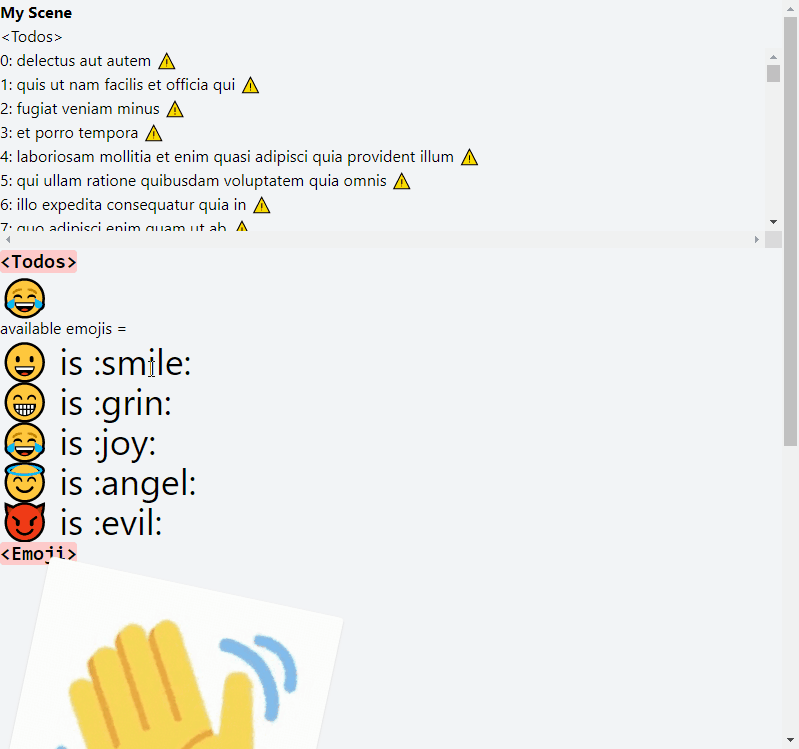

# Metamorph

Exploring and experimenting what could be an interface for end-user programming

This project is *really* early in development, it's a proof of concept.
Abstractions and D/UX will come later.

This project is an Electron app that uses Vite as an automatic "compiler" every time you make changes to the app itself.
It is working by emulating the fact that you would be writing .vue components by hand (but you're actually sending events to edit or create the files in the background).

You can edit components with an "Inspector", which is a component too, so you can edit the inspector.
It's (meant to be) editable from the ground up.

## Usage

- `yarn` (once, to install dependencies)
- `yarn start` (to run playground)

## Inspirations

> There shouldn’t be a chasm that the user has to cross in order to customize the behavior of their software. Going from using to inspecting to modifying the system should be a gradual process where each of the steps is small enough to be easily discoverable. The user should not need to switch to “programmer mindset” but instead stay within the context of the application. They can stay close to their work and their ideas.

[Ink & Switch - End User Programming](https://www.inkandswitch.com/end-user-programming.html)

- [Notion](https://www.notion.so/)
- [HyperCards](https://www.vipercard.net/0.3/html/video3.html)
- [ObservableHQ](https://observablehq.com/demo)
- [Glamorous Toolkit](https://gtoolkit.com)
- [WithEve](http://witheve.com)
- [Drawing Dynamic Visualizations - Bret Victor](http://worrydream.com/DrawingDynamicVisualizationsTalkAddendum/)
